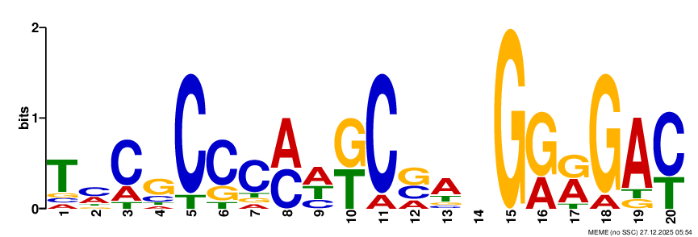
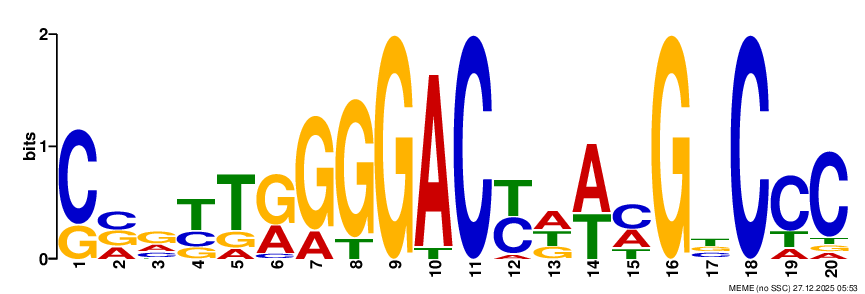
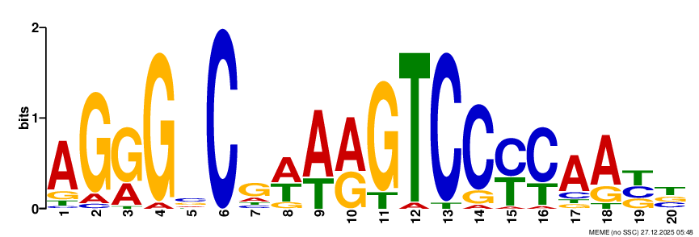
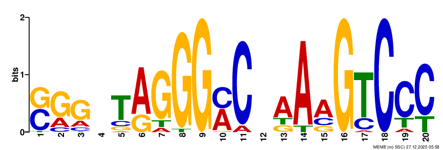
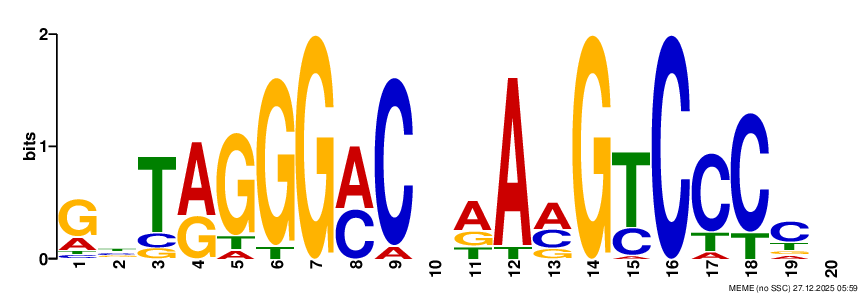

# MTB_Hypoxia_Motif_Project
Motif discovery in hypoxia-induced genes of Mycobacterium tuberculosis using MEME.
This repository contains motif discovery analysis for hypoxia-induced genes of Mycobacterium tuberculosis usuing MEME. It includes using motif logos of upstream regions of varying lengths, as well as images showing the motif locations.
## Motif Logos
The images below show the motif logos in upstream regions of different lengths:
### 25 bp upstream

### 100 bp upstream

### 250 bp upstream

### 500 bp upstream

### 1000 bp upstream

## Motif Locations
The images below show the motif positions in upstream regions of different lengths:
### Motif Location 25bp

### Motif Location 100bp

### Motif Location 250bp

### Motif Location 500bp

### Motif Location 1000bp

